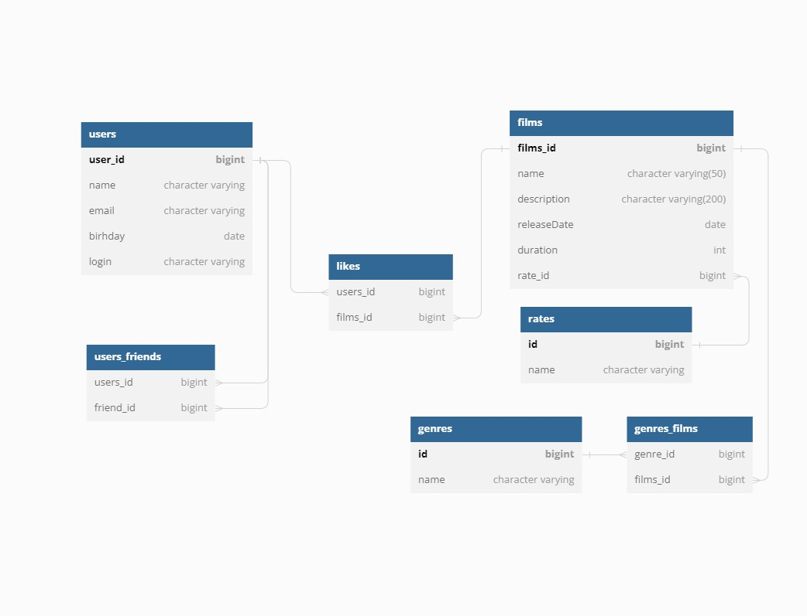

# java-filmorate
Template repository for Filmorate project.

Схема базы данных:

Основные запросы:

Получить всех пользователей: 
SELECT * FROM users 

Получить всех друзей для пользователя c {id}: 
SELECT * FROM users 
WHERE id in( 
SELECT friend_id 
FROM users_friends where user_id = {id}) 

Получить общих друзей для пользователей c {id1}, {id2}: 
SELECT * FROM users 
WHERE users.id in 
(SELECT u.id 
FROM users u 
JOIN users_users uf ON u.id = uf.users_id 
WHERE uf.users_id = 1 OR uf.users_id = 2 
GROUP BY u.id 
HAVING count(u.id)=2) 

Получить список всех фильмов: 
SELECT * FROM films  

Получить список всех фильмов с жанром {genre}: 
SELECT * FROM films f 
JOIN genres_films gf ON f.id = gf.films_id 
JOIN genres gs ON gs.id = gf.genre_id 
WHERE gs."name" = {genre} 

Получить список всех фильмов лайкнутых пользователем с {id}: 
SELECT * FROM films f 
JOIN likes l ON l.films_id = f.id 
JOIN users u ON u.id = l.users_id 
WHERE u.id = {id} 

Получить 10 самых популярных фильмов: 
SELECT * FROM films 
WHERE films.id in( 
SELECT f.id FROM films f 
JOIN likes l ON f.id = l.films_id 
GROUP BY f.id 
ORDER BY count(f.id) 
LIMIT 10) 
